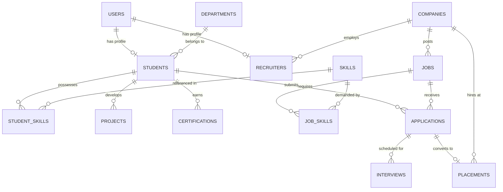

# PLACEMENTIQ AI
## AI-Powered Campus Career & Placement Intelligence Platform
### Master Architecture & Hackathon Execution Plan

---

## 1. Executive Summary & Vision

**PlacementIQ AI** is an intelligent career and placement intelligence ecosystem that bridges the gap between:
$$\text{Student Skills} \longleftrightarrow \text{Industry Requirements} \longleftrightarrow \text{Institutional Placement Data}$$

Unlike legacy college placement management portals that act as static CRUD tables or job-listing notice boards, PlacementIQ AI functions as an **autonomous placement copilot and institutional analytics engine**. It provides **explainable AI candidate matching**, **AI Career Twin profiling**, **dynamic skill gap identification**, **actionable weekly learning roadmaps**, and **campus-wide skill demand-versus-availability intelligence**.

---

## 2. System Architecture

```
+-----------------------------------------------------------------------------------+
|                                 CLIENT LAYER                                      |
|  - Modern Dark/Light Themed SaaS UI (HTML5, Vanilla CSS3, Modular ES6 JS)        |
|  - Chart.js Placement & Skill Analytics Visualizations                           |
|  - Lucide Vector Iconography & Glassmorphic Surfaces                              |
|  - Role-Optimized Portals: [Student] | [Recruiter] | [Admin]                      |
+-----------------------------------------+-----------------------------------------+
                                          |
                                          v
+-----------------------------------------------------------------------------------+
|                           FLASK REST API & ROUTING                                |
|  - Auth Routes (/api/auth)         - Student Routes (/api/student)                |
|  - Recruiter Routes (/api/recruiter) - Admin & Analytics (/api/admin, /analytics) |
|  - Job Routes (/api/jobs)          - Applications & Interviews Routes             |
+-----------------------------------------+-----------------------------------------+
                                          |
                                          v
+-----------------------------------------------------------------------------------+
|                               SERVICE LAYER                                       |
|  - profile_service.py   - job_service.py         - application_service.py          |
|  - scheduling_service.py - analytics_service.py                                    |
+-------------------+-------------------------------------+-------------------------+
                    |                                     |
                    v                                     v
+-----------------------------------+   +-------------------------------------------+
|          AI & ML ENGINES          |   |            DATA ACCESS LAYER              |
| 1. Deterministic Match Engine     |   | - SQLAlchemy ORM Models                   |
|    (Configurable Multi-Factor)    |   | - SQLite (Dev/Demo) -> Postgres Ready     |
| 2. AI Skill Gap & Roadmap Engine  |   | - Automatic Seed Database (20+ students,  |
| 3. AI Career Twin & Copilot       |   |   5 recruiters, 10 jobs, 30+ skills)      |
| 4. AI Interview Simulator         |   +-------------------------------------------+
| 5. Scikit-learn TF-IDF Sim Engine |
| 6. LLM Provider / Demo Fallback   |
+-----------------------------------+
```

---

## 3. Database Entity-Relationship (ER) Design

The database schema is fully normalized with explicit relationships, indices, status enumerations, and timestamps.



### Table Specifications:

1. **`users`**
   - `id`: Integer (PK)
   - `email`: String(120) (Unique, Indexed)
   - `password_hash`: String(255)
   - `role`: Enum ('student', 'recruiter', 'admin')
   - `created_at`: DateTime

2. **`departments`**
   - `id`: Integer (PK)
   - `code`: String(10) (e.g. 'CSE', 'IT', 'ECE', 'DS')
   - `name`: String(100)

3. **`students`**
   - `id`: Integer (PK)
   - `user_id`: Integer (FK -> users.id, Unique)
   - `roll_number`: String(50) (Unique)
   - `name`: String(120)
   - `department_id`: Integer (FK -> departments.id)
   - `year`: Integer (e.g., 3, 4)
   - `cgpa`: Float
   - `target_role`: String(100) (e.g., 'Data Analyst', 'Full Stack Developer')
   - `preferred_locations`: String(200)
   - `preferred_industries`: String(200)
   - `resume_filename`: String(255)
   - `bio`: Text
   - `avatar_url`: String(255)
   - `readiness_score`: Float (Computed dynamic metric)
   - `created_at`: DateTime

4. **`companies`**
   - `id`: Integer (PK)
   - `name`: String(150) (Unique)
   - `website`: String(200)
   - `industry`: String(100)
   - `logo_url`: String(255)
   - `description`: Text
   - `location`: String(150)

5. **`recruiters`**
   - `id`: Integer (PK)
   - `user_id`: Integer (FK -> users.id, Unique)
   - `company_id`: Integer (FK -> companies.id)
   - `name`: String(120)
   - `designation`: String(100)
   - `phone`: String(20)

6. **`skills`**
   - `id`: Integer (PK)
   - `name`: String(100) (Unique, Indexed)
   - `category`: Enum ('technical', 'soft', 'tool', 'domain')

7. **`student_skills`**
   - `id`: Integer (PK)
   - `student_id`: Integer (FK -> students.id)
   - `skill_id`: Integer (FK -> skills.id)
   - `proficiency_level`: Enum ('beginner', 'intermediate', 'advanced')
   - `verified`: Boolean (Default False)

8. **`projects`**
   - `id`: Integer (PK)
   - `student_id`: Integer (FK -> students.id)
   - `title`: String(150)
   - `description`: Text
   - `tech_stack`: String(255) (Comma-separated skills/tags)
   - `github_url`: String(255)
   - `live_url`: String(255)

9. **`certifications`**
   - `id`: Integer (PK)
   - `student_id`: Integer (FK -> students.id)
   - `name`: String(150)
   - `issuing_org`: String(150)
   - `issue_date`: Date
   - `credential_url`: String(255)

10. **`jobs`**
    - `id`: Integer (PK)
    - `company_id`: Integer (FK -> companies.id)
    - `recruiter_id`: Integer (FK -> recruiters.id)
    - `title`: String(150)
    - `role_category`: String(100)
    - `description`: Text
    - `min_cgpa`: Float (Default 0.0)
    - `experience_level`: String(50)
    - `location`: String(150)
    - `salary_min`: Float (LPA)
    - `salary_max`: Float (LPA)
    - `status`: Enum ('active', 'closed')
    - `deadline`: Date
    - `created_at`: DateTime

11. **`job_skills`**
    - `id`: Integer (PK)
    - `job_id`: Integer (FK -> jobs.id)
    - `skill_id`: Integer (FK -> skills.id)
    - `is_required`: Boolean (Default True)
    - `importance_weight`: Float (1.0 to 3.0)

12. **`applications`**
    - `id`: Integer (PK)
    - `job_id`: Integer (FK -> jobs.id)
    - `student_id`: Integer (FK -> students.id)
    - `status`: Enum ('applied', 'eligible', 'ai_matched', 'shortlisted', 'interview', 'selected', 'placed', 'rejected')
    - `match_score`: Float
    - `match_breakdown_json`: Text (Stores factor scores, reasons, gaps)
    - `applied_at`: DateTime
    - `updated_at`: DateTime

13. **`interviews`**
    - `id`: Integer (PK)
    - `application_id`: Integer (FK -> applications.id)
    - `scheduled_date`: Date
    - `scheduled_time`: String(20)
    - `interview_type`: Enum ('technical', 'hr', 'coding', 'managerial')
    - `round_number`: Integer
    - `meeting_link_or_venue`: String(255)
    - `interviewer_name`: String(120)
    - `status`: Enum ('scheduled', 'completed', 'cancelled')
    - `feedback`: Text
    - `score`: Float

14. **`placements`**
    - `id`: Integer (PK)
    - `student_id`: Integer (FK -> students.id)
    - `job_id`: Integer (FK -> jobs.id)
    - `company_id`: Integer (FK -> companies.id)
    - `package_lpa`: Float
    - `placed_date`: Date
    - `academic_year`: String(10) (e.g. '2025-2026')

---

## 4. API Endpoints Plan

### Authentication (`/api/auth`)
- `POST /api/auth/register` - Create account (Student or Recruiter)
- `POST /api/auth/login` - Authenticate & obtain session
- `POST /api/auth/logout` - Invalidate session
- `GET  /api/auth/me` - Get current session user profile

### Student Module (`/api/student`)
- `GET  /api/student/profile` - Full profile with skills, projects, certifications
- `PUT  /api/student/profile` - Update profile details
- `GET  /api/student/career-twin` - Generates AI Career Twin metrics & narrative insight
- `GET  /api/student/skill-gap` - Calculates matched, missing, weak skills against target role or job
- `GET  /api/student/roadmap` - Generates dynamic 4-week actionable learning roadmap
- `POST /api/student/copilot/chat` - Interactive AI Career Copilot Q&A
- `POST /api/student/interview-sim/start` - Start simulated mock interview for selected role
- `POST /api/student/interview-sim/evaluate` - Evaluate student answer (Accuracy, Clarity, Completeness)

### Jobs & Discovery (`/api/jobs`)
- `GET  /api/jobs` - Filterable job listings with real-time student match scores
- `GET  /api/jobs/<id>` - Full job details + Explainable Match Breakdown
- `POST /api/jobs` - Create job listing (Recruiter only)
- `POST /api/jobs/analyze-jd` - AI JD parsing (extracts skills, experience, qualifications)

### Applications & Pipeline (`/api/applications`)
- `POST /api/applications/apply` - Submit job application
- `GET  /api/applications/my-applications` - Student application tracker
- `GET  /api/applications/job/<job_id>` - Recruiter applicants list with AI scores
- `PUT  /api/applications/<id>/status` - Advance pipeline stage

### Interviews & Scheduling (`/api/interviews`)
- `POST /api/interviews/schedule` - Recruiter schedules interview
- `GET  /api/interviews/student` - Student upcoming interview schedule
- `GET  /api/interviews/recruiter` - Recruiter interview calendar
- `PUT  /api/interviews/<id>/feedback` - Submit evaluation & score

### Admin & Placement Analytics (`/api/admin` & `/api/analytics`)
- `GET  /api/admin/overview-kpis` - Real-time placement metrics
- `GET  /api/analytics/placement-rates` - Department-wise & batch placement stats
- `GET  /api/analytics/recruitment-funnel` - Visual funnel: Applied -> Eligible -> Matched -> Shortlisted -> Placed
- `GET  /api/analytics/salary-trends` - Package distribution by role & department
- `GET  /api/analytics/campus-skill-intelligence` - Industry demand vs Campus availability matrix + curriculum training recommendations

---

## 5. AI & Analytics Architecture

```
                       +---------------------------------------+
                       |           STUDENT & JOB DATA          |
                       +-------------------+-------------------+
                                           |
                   +-----------------------+-----------------------+
                   |                                               |
                   v                                               v
+---------------------------------------+       +---------------------------------------+
|   DETERMINISTIC MATCH ENGINE (40%)    |       |   SEMANTIC & ML TF-IDF ENGINE (20%)   |
| - Required Skills Overlap (45%)       |       | - Scikit-Learn TF-IDF Vectorizer      |
| - Preferred Skills Overlap (15%)      |       | - Cosine Similarity between Resume    |
| - Projects Relevance (15%)            |       |   Projects & Job Description          |
| - Academic & CGPA Eligibility (10%)   |       | - Co-occurrence Clustering            |
| - Experience Level Fit (10%)          |       +---------------------------------------+
| - Certifications (5%)                 |                          |
+-------------------+-------------------+                          |
                    |                                              |
                    +-----------------------+----------------------+
                                            |
                                            v
                        +---------------------------------------+
                        |     EXPLAINABLE SCORE COMPOSER        |
                        | - Composite Score (0 - 100%)          |
                        | - Factor Contributions Breakdown      |
                        | - "Why You Match" Reasoning Points    |
                        | - "Missing Skill Gaps"                |
                        | - "Recommended Actions"               |
                        +-------------------+-------------------+
                                            |
                                            v
                        +---------------------------------------+
                        |      LLM REASONING & COPILOT          |
                        | - Live Gemini API integration         |
                        | - High-Fidelity Local Deterministic   |
                        |   Fallback Engine (DEMO MODE)         |
                        | - Profile Narrative & Career Roadmap  |
                        | - Mock Interview Evaluator            |
                        +---------------------------------------+
```

### Transparent Scoring Weights:
- **Required Skills**: $45\%$
- **Preferred Skills**: $15\%$
- **Projects Relevance**: $15\%$
- **Academic Eligibility & CGPA**: $10\%$
- **Experience Match**: $10\%$
- **Certifications**: $5\%$

---

## 6. Development Phases

- **Phase 1**: Architecture + Database + Models + Seed Data + Authentication
  - Configure Flask, SQLAlchemy, blueprints, config, and `.env`.
  - Build seed data script generating 20 realistic students, 5 companies, 10 jobs, 35 skills, applications, interviews, and placements.
  - Implement secure password hashing, session management, and role-based access.

- **Phase 2**: Core Placement Workflows & Dashboards
  - Student, Recruiter, and Admin base layouts and interactive dashboards.
  - Profile management, job creation, and application submission.

- **Phase 3**: AI Profile Analysis + Skill Gap Engine + JD Analyzer + Explainable Matching
  - Implement deterministic + ML matching algorithm with factor breakdown.
  - Build Skill Gap Engine with Priority categorization (High/Medium/Low).
  - Implement AI JD Analyzer extracting skills and requirements.

- **Phase 4**: Career Roadmap + AI Career Copilot + AI Interview Simulator
  - Dynamic 4-week timeline roadmap generated from real student gaps.
  - Contextual conversational Career Copilot grounded in student data.
  - Interactive Mock Interview Simulator with rubrics: Technical Accuracy, Clarity, Completeness.

- **Phase 5**: Interview Scheduling + Visual Recruitment Pipeline
  - Recruiter interview scheduling modal and student interview calendar card.
  - Interactive pipeline (Applied -> Eligible -> AI Matched -> Shortlisted -> Interview -> Selected -> Placed).

- **Phase 6**: Placement Analytics + Campus Skill Intelligence
  - Dynamic Chart.js visualizations (Department placement, Recruitment Funnel, Salary Distribution).
  - **Campus Skill Intelligence**: Industry Demand vs Campus Availability matrix with automated training priority alerts.

- **Phase 7**: UI/UX Polish + Micro-animations + Responsive Design + Error Handling
  - Premium SaaS aesthetic: Deep slate dark mode, glassmorphism cards, glowing accents, smooth transitions.
  - Custom 404/500 error pages and robust AI API fallback state.

- **Phase 8**: Full End-to-End Testing & Hackathon Demo Preparation
  - Automated smoke test suite (`pytest` / unittest).
  - Detailed `README.md`, `PROJECT_ARCHITECTURE.md`, `API_DOCUMENTATION.md`, `AI_ARCHITECTURE.md`.
  - Demo accounts cheat-sheet for live presentation.

---

## 7. File Manifest

```
Campus-Link/
├── app.py                      # Flask Application factory & runner
├── config.py                   # Environment-driven app configurations
├── requirements.txt            # Python dependencies (Flask, SQLAlchemy, scikit-learn, etc.)
├── .env.example                # Sample environment variables
├── .gitignore                  # Git ignore rules
├── PROJECT_PLAN.md             # Master execution plan (this document)
├── PROJECT_ARCHITECTURE.md     # In-depth architectural documentation
├── API_DOCUMENTATION.md        # API routes & schema reference
├── AI_ARCHITECTURE.md          # Explainable AI, ML & LLM engine documentation
├── README.md                   # Comprehensive setup & hackathon demo guide
│
├── models/                     # SQLAlchemy Models
│   ├── __init__.py
│   ├── user.py
│   ├── department.py
│   ├── student.py
│   ├── recruiter.py
│   ├── company.py
│   ├── skill.py
│   ├── project.py
│   ├── certification.py
│   ├── job.py
│   ├── application.py
│   ├── interview.py
│   └── placement.py
│
├── routes/                     # Blueprint Handlers
│   ├── __init__.py
│   ├── auth.py
│   ├── student.py
│   ├── recruiter.py
│   ├── admin.py
│   ├── jobs.py
│   ├── applications.py
│   ├── interviews.py
│   └── analytics.py
│
├── services/                   # Business Logic Services
│   ├── __init__.py
│   ├── profile_service.py
│   ├── job_service.py
│   ├── application_service.py
│   ├── scheduling_service.py
│   └── analytics_service.py
│
├── ai/                         # AI & Intelligence Engines
│   ├── __init__.py
│   ├── profile_analyzer.py     # AI Career Twin analysis & insights
│   ├── skill_extractor.py      # Skill taxonomy extraction
│   ├── skill_gap_engine.py     # Gap detection & priority classification
│   ├── jd_analyzer.py          # Job description parsing & attribute extraction
│   ├── matching_engine.py      # Explainable weighted matching engine
│   ├── career_roadmap.py       # Personalized 4-week actionable timeline
│   ├── career_copilot.py       # Conversational placement copilot
│   ├── interview_engine.py     # Mock interview simulator & evaluator
│   └── llm_client.py           # Provider wrapper (Gemini API with Demo Mode fallback)
│
├── ml/                         # Machine Learning Modules
│   ├── __init__.py
│   ├── preprocessing.py        # Text cleaning & skill normalization
│   ├── models.py               # TF-IDF candidate similarity & clustering
│   └── training.py             # Feature vectors & taxonomy weights
│
├── templates/                  # Jinja2 HTML Templates
│   ├── base.html               # Master layout with navbar, theme & modals
│   ├── landing.html            # Premium SaaS landing page
│   ├── login.html              # Authentication login view
│   ├── register.html           # Authentication registration view
│   ├── 404.html                # Custom 404 error page
│   ├── 500.html                # Custom 500 error page
│   ├── student/
│   │   ├── dashboard.html      # Student dashboard with Career Twin & Roadmap
│   │   ├── profile.html        # Student profile management
│   │   ├── jobs.html           # Job discovery with Explainable Match cards
│   │   ├── applications.html   # Applied jobs & status timeline
│   │   ├── interviews.html     # Upcoming interview calendar & links
│   │   └── simulator.html      # Interactive AI Mock Interview Simulator
│   ├── recruiter/
│   │   ├── dashboard.html      # Recruiter overview & candidate pipeline
│   │   ├── post_job.html       # Job posting with live AI JD analyzer
│   │   ├── candidates.html     # Candidate evaluation with AI insight cards
│   │   └── schedule.html       # Interview scheduling calendar
│   └── admin/
│       ├── dashboard.html      # Institutional placement command center
│       ├── analytics.html      # Multi-dimensional Chart.js visualizations
│       └── skills.html         # Campus Skill Intelligence (Demand vs Supply)
│
├── static/                     # Static Assets
│   ├── css/
│   │   ├── main.css            # Design tokens, themes, global CSS
│   │   ├── landing.css         # SaaS landing page styling
│   │   ├── dashboard.css       # Layout, sidebar, KPI cards, pipelines
│   │   └── components.css      # Badges, roadmaps, modals, chat widgets
│   ├── js/
│   │   ├── main.js             # Utility helpers, toasts, modal controllers
│   │   ├── student.js          # Career Twin, Copilot chat, Interview sim
│   │   ├── recruiter.js        # Pipeline dragging, JD analyzer, scheduling
│   │   ├── admin.js            # Analytics chart instantiations & skill matrix
│   │   └── charts.js           # Reusable Chart.js presets & config
│   └── images/                 # App logos, empty states, avatars
│
├── data/                       # Seed Datasets & Database Initializer
│   ├── seed_data.py            # Comprehensive database seeder
│   ├── students.csv            # 20+ realistic student profiles
│   ├── jobs.csv                # 10 realistic company job postings
│   ├── skills.csv              # 35+ classified skills taxonomy
│   └── placements.csv          # Historic and current placement records
│
└── tests/                      # Automated Test Suite
    ├── test_auth.py
    ├── test_matching.py
    ├── test_skill_gap.py
    └── test_analytics.py
```
